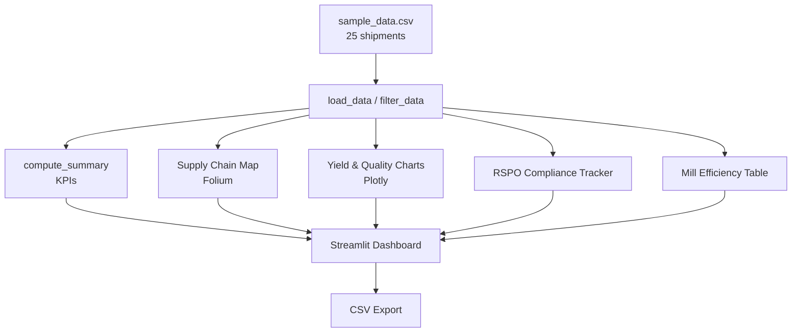

# CPO Supply Chain Tracker

[](https://streamlit.io)
[](https://python.org)
[](LICENSE)
[](tests/)
[](https://github.com/achmadnaufal/cpo-supply-chain-tracker/commits)

Interactive Streamlit dashboard for tracking crude palm oil (CPO) supply chains from plantation to mill. Provides RSPO compliance monitoring, yield trend analysis, and mill processing efficiency metrics across Indonesian provinces.

## Architecture



## Quick Start

```bash
pip install -r requirements.txt
streamlit run app.py
pytest tests/
```

## Features

- **Interactive Supply Chain Map** — Folium map showing plantation locations (color-coded by RSPO status), mill destinations, and transport routes with layer controls
- **Yield Trend Analysis** — Monthly FFB and CPO yield trends, province breakdown sunburst chart, and CPO quality scatter plots (Plotly)
- **Mill Processing Efficiency** — Extraction rate comparison across mills, efficiency summary table, and transport distance distribution
- **RSPO Compliance Tracker** — Certification status per plantation, audit overdue detection, and interactive compliance checklist based on RSPO Principles & Criteria
- **Raw Data Explorer** — Filterable data table with CSV download capability

## Usage

Run the bundled summary against the sample dataset:

```bash
python -c "from app import load_data, compute_summary, create_mill_efficiency_table; \
df=load_data(); s=compute_summary(df); print(s); \
print(create_mill_efficiency_table(df).to_string(index=False))"
```

Real captured output:

```
Loaded 25 shipment records across 6 provinces
Plantations: 25  |  Mills: 6
Total FFB: 660.0 t  |  Total CPO: 145.8 t
Avg extraction rate: 21.9%
RSPO-certified shipments: 68.0%

Mill efficiency:
mill_id            mill_name  shipments  avg_extraction_pct  avg_ffa_pct  certified_suppliers  total_cpo_tonnes
   M001       PKS Dumai Jaya          5                22.8          2.8                    5              35.6
   M002   PKS Medan Industri          5                21.6          3.3                    3              25.0
   M003 PKS Pontianak Makmur          5                22.2          3.1                    3              31.5
   M004   PKS Sampit Perdana          4                21.0          3.4                    2              18.7
   M005  PKS Palembang Utama          3                21.7          3.2                    2              17.7
   M006  PKS Jambi Sejahtera          3                22.0          3.1                    2              17.2
```

## Sample Output

The dashboard includes 25 records across 6 Indonesian provinces (Riau, North Sumatra, West Kalimantan, Central Kalimantan, South Sumatra, Jambi) covering:
- FFB yields from 18,200 kg to 35,100 kg per shipment
- Extraction rates between 19% and 23%
- Both truck and barge transport modes
- Mix of RSPO-certified and non-certified plantations
- Smallholder and estate plantations

## Tech Stack

| Component | Technology |
|-----------|-----------|
| Frontend | Streamlit |
| Data | Pandas |
| Charts | Plotly |
| Maps | Folium + streamlit-folium |
| Testing | pytest |

## Project Structure

```
cpo-supply-chain-tracker/
├── app.py                  # Main Streamlit application
├── demo/
│   └── sample_data.csv     # 25 rows of realistic Indonesian CPO data
├── tests/
│   ├── conftest.py         # Shared test fixtures
│   ├── test_data_loading.py
│   ├── test_data_processing.py
│   ├── test_charts.py
│   ├── test_map.py
│   └── test_rspo.py
├── docs/
│   └── SCREENSHOTS.md      # Documentation of all dashboard views
├── requirements.txt
├── LICENSE
└── README.md
```

## License

This project is licensed under the MIT License. See the [LICENSE](LICENSE) file for details.

---

> Built by [Achmad Naufal](https://github.com/achmadnaufal) | Lead Data Analyst | Power BI · SQL · Python · GIS
